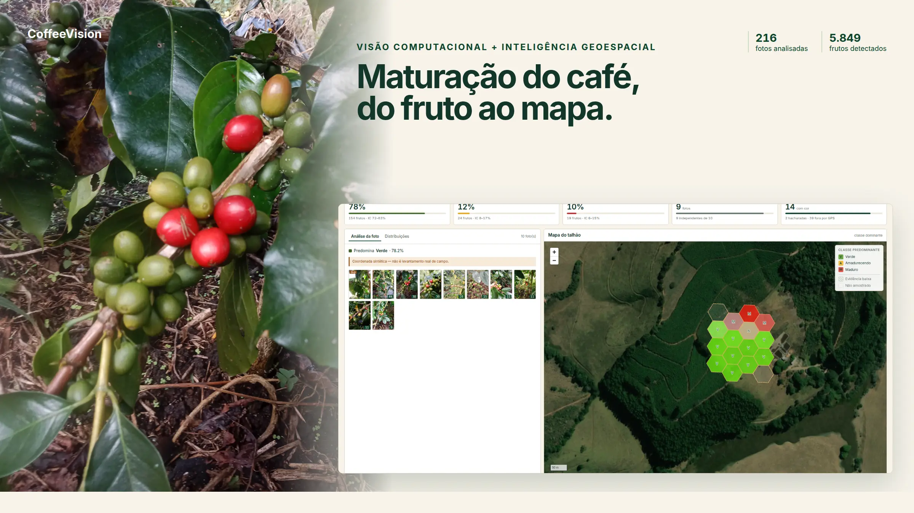
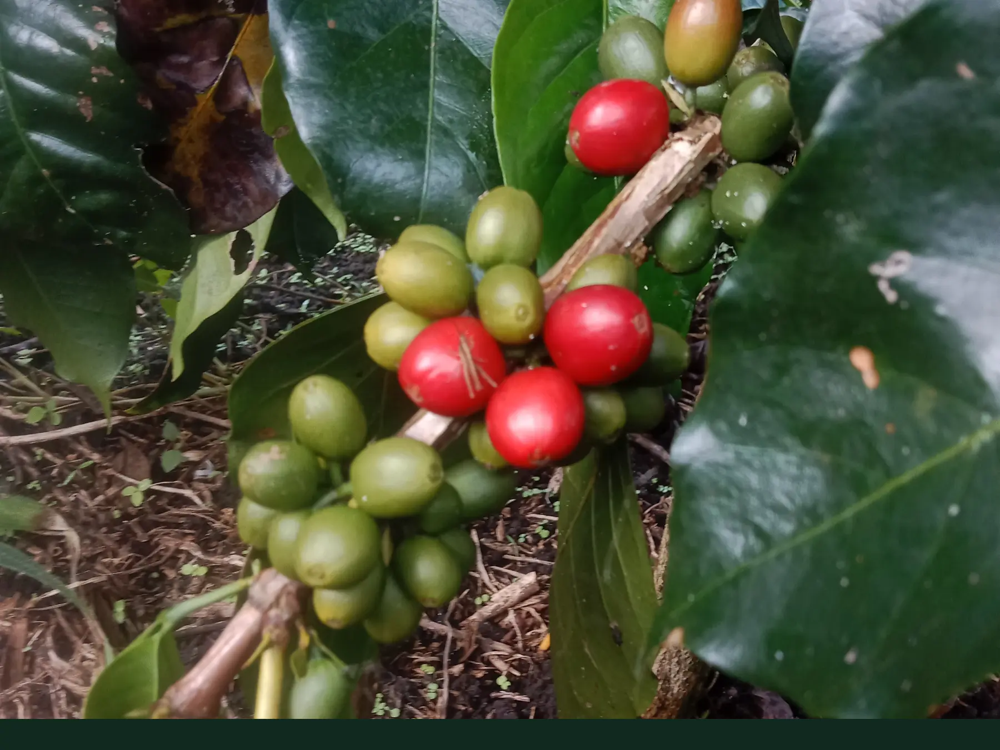
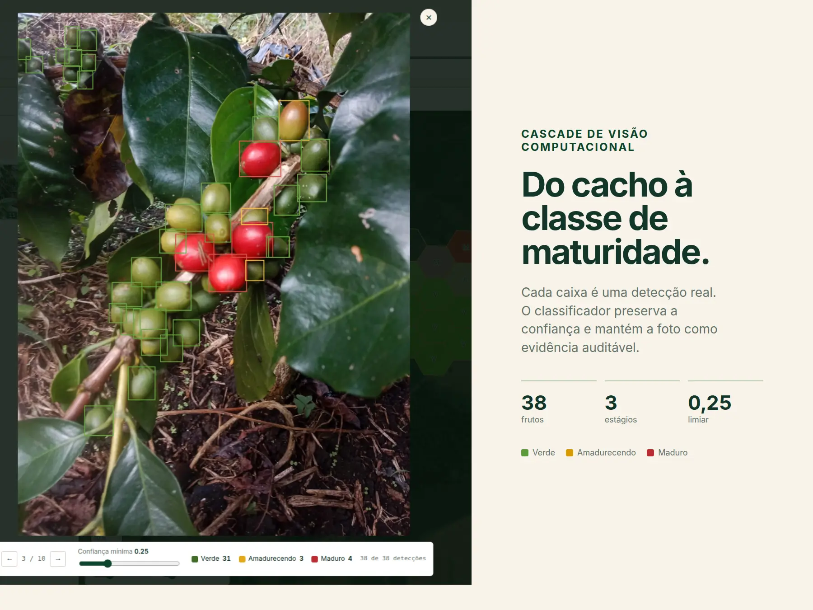
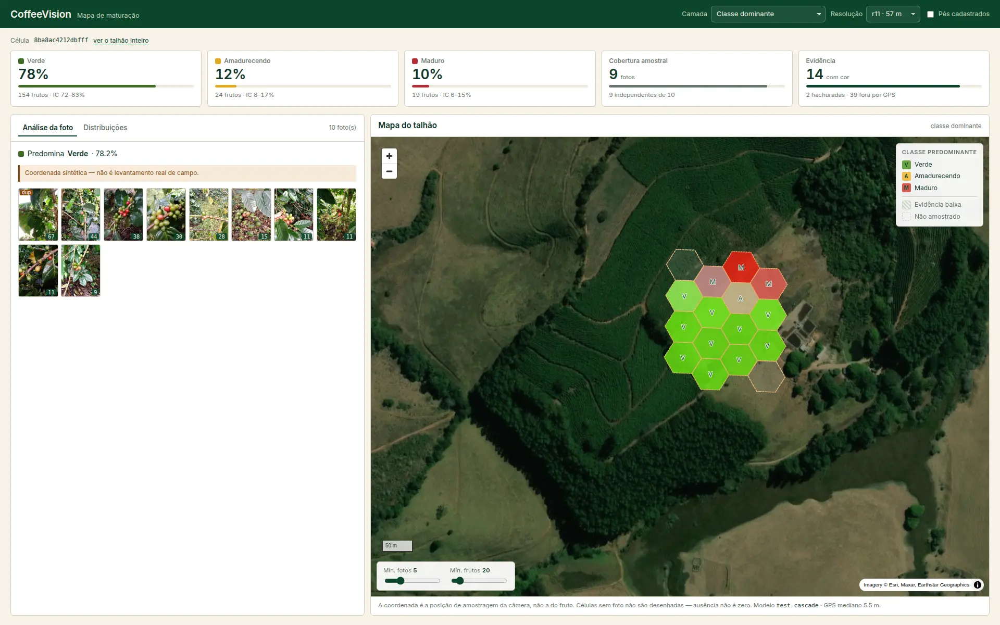
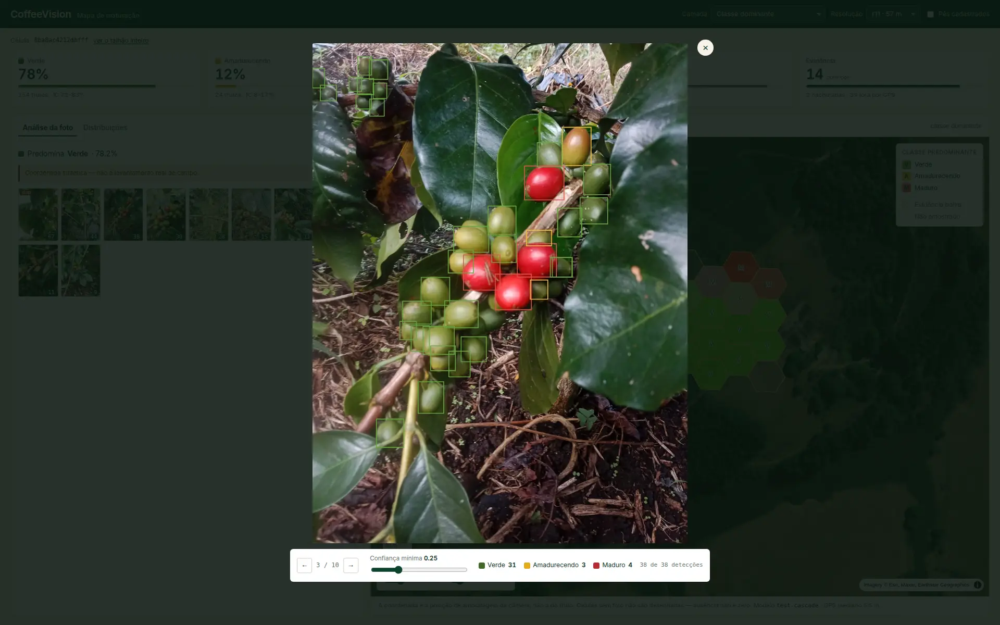
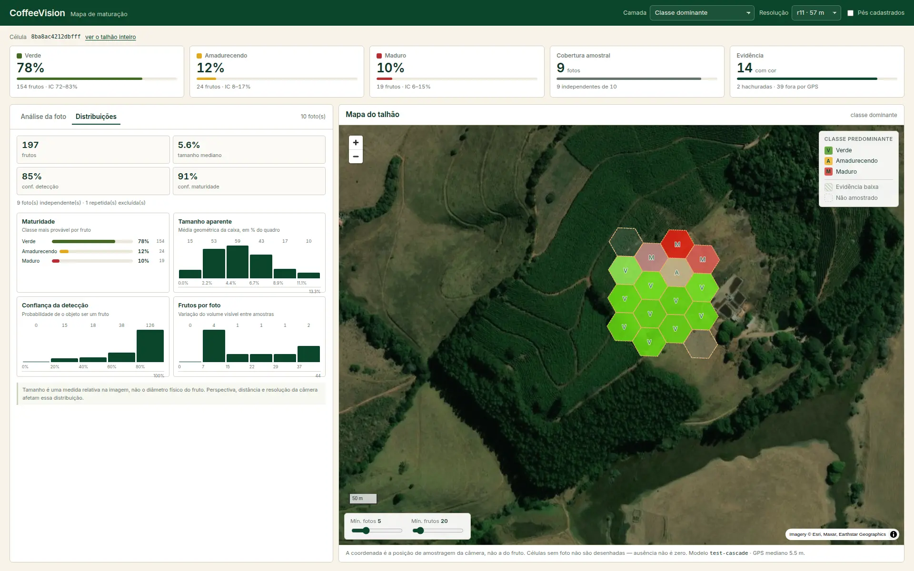
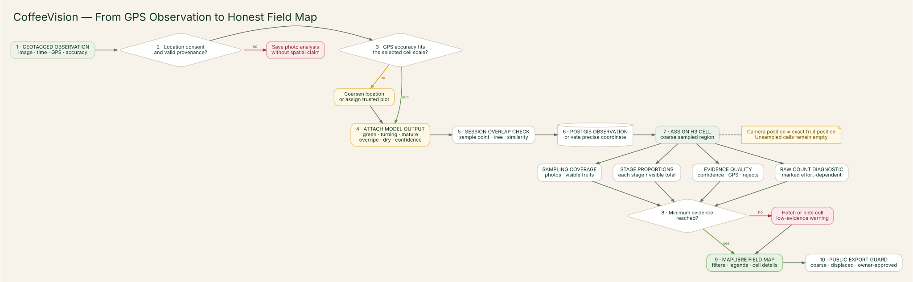
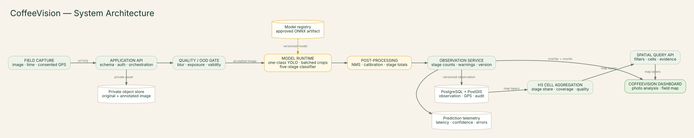
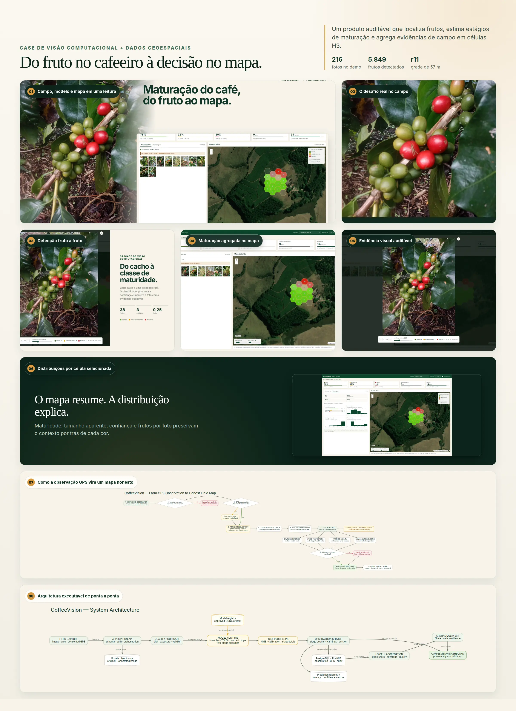

# CoffeeVision

CoffeeVision is a computer-vision and geospatial analytics case study for coffee
field surveys. It detects individual cherries in field photographs, estimates
their maturity stage, preserves photo-level evidence, and aggregates observations
into an honest H3 map instead of presenting sampling density as crop condition.

> This repository is the public, media-only presentation of the project. It
> contains the case-study images and technical diagrams, not the application,
> training data, model weights, or private field coordinates.

## What the product demonstrates

- Class-agnostic coffee-cherry detection followed by crop-level maturity
  classification.
- Per-fruit boxes, confidence, maturity probabilities, and apparent-size
  measurements.
- FastAPI ingestion backed by PostgreSQL/PostGIS.
- H3 aggregation with configurable minimum evidence and GPS-accuracy gates.
- A React + MapLibre interface where every colored cell can be audited through
  its source photographs.
- Fruit distributions for maturity, apparent size, confidence, and detections per
  photograph.

## Portfolio demo

| Demonstration set | Value |
| --- | ---: |
| Photographic observations | 216 |
| Fruit detections | 5,849 |
| Displayed maturity stages | 3 |
| Map resolution | H3 r11 · approximately 57 m |

The demo uses a deterministic 50% sample of the local annotated dataset plus four
project-root test images. Model measurements come from the executable cascade;
the map positions are deliberately synthetic/displaced. These values describe the
demonstration dataset and are **not** final model-validation metrics.

## From field image to spatial evidence

  
  

Natural scenes contain occlusion, mixed maturity, small fruit, uneven illumination,
and dense clusters. CoffeeVision keeps the original photograph connected to every
prediction so the user can inspect what produced each summary.

  
  

The map shows only sampled cells. Cells below the configured photo or fruit count
remain neutral, observations with incompatible GPS accuracy are excluded, and
unsampled areas are never interpolated as measured crop condition.

## Technical design

### Geospatial aggregation

### System architecture

The pipeline separates capture, quality checks, inference, persistence, spatial
aggregation, and presentation. Model versions and prediction latency are stored
with observations so that a map result can be traced back to its evidence and
inference configuration.

## Stack

`Python` · `PyTorch` · `Ultralytics` · `OpenCV` · `FastAPI` · `PostgreSQL` ·
`PostGIS` · `H3` · `React` · `TypeScript` · `MapLibre` · `Docker`

## Product boundaries

CoffeeVision supports visual sampling; it does not infer whole-farm yield from one
image, diagnose disease without suitable labels, or automate harvest decisions
without human review. A production deployment also requires a reviewed field
bridge set, approved dataset/model licensing, and explicit authorization for any
precise farm coordinates.

## Gallery

---

Designed and developed by [Miguel L. Rodrigues](https://miguellrodrigues.github.io/).

